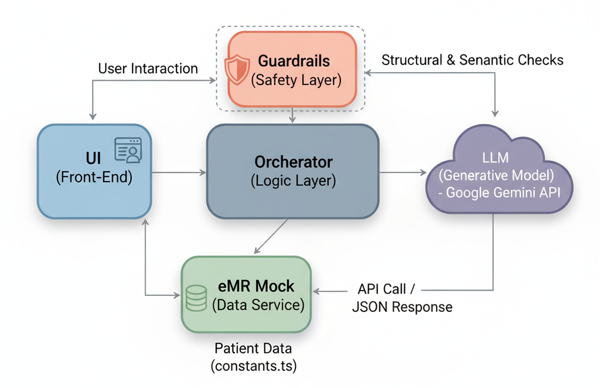

# AI Healthcare Agent

An AI-powered clinical decision support system designed to reduce clinician cognitive overload. This prototype analyzes mock Electronic Medical Record (eMR) data using Google's Gemini to provide evidence-based treatment suggestions, safety alerts, and draft care plans for clinicians.

## Demo
<video controls src="Agent_Demo.mov" title="Title"></video>
## About The Project
Clinicians today are grappling with an immense cognitive burden, a direct result of rising patient complexity and an ever-growing mountain of data. This situation calls for new, intelligent tools to aid in clinical decision-making.

The AI Healthcare Agent is a prototype system designed to function as a clinical partner, assisting medical staff by providing secure, AI-based assistance.

At its heart, the system uses Google's Gemini to sift through mock eMR data (vitals, medications, allergies, notes) and propose evidence-based care plans. The prototype’s design is built on a novel hybrid safety architecture, which combines the generative power of the LLM with the reliability of structural guardrails (via JSON schema) and the crucial element of human-in-the-loop oversight.

## Research
This prototype is the practical output of a research project titled: "How Autonomous AI Agents Can Streamline Healthcare Delivery and Enhance Patient Care." 

The accompanying paper details the system's hybrid safety architecture , RAG-like approach , and the results of our evaluation against a synthetic patient cohort. You can read the full paper here: [Research Paper](https://www.linkedin.com/pulse/how-autonomous-ai-agents-can-streamline-healthcare-delivery-prasad-vjtjc)

## Core Features

- Patient Dashboard: Select from a list of mock patients to view their complete clinical profile.

- One-Click Care Plan: Generate a comprehensive AI-powered care plan with a single button click.

- Critical Safety Alerts: Prominently displays color-coded alerts for high, medium, and low-risk issues, such as Drug Interactions, Allergies, and Dose Warnings.

- SBAR Summary: Automatically generates a structured Situation, Background, Assessment, Recommendation summary, fitting directly into existing clinical workflows.

- Evidence-Based Suggestions: Provides detailed suggestion cards for each clinical problem, complete with rationale, monitoring instructions, and citations.

- Confidence & Uncertainty: Each plan includes a Confidence Score and a section outlining any Uncertainty & Missing Context, promoting clinical oversight.

- Interactive Follow-up: A built-in chat allows clinicians to ask contextual follow-up questions about the generated plan (e.g., "What are the alternative antibiotics for this patient?").

- Audit View: A "View JSON" toggle allows for auditing the raw, structured output from the LLM.

## Technology Stack
- Front-End: React, TypeScript

- AI Model: Google Gemini API (@google/genai)

- Build Tool: Vite

- Styling: Tailwind CSS

- Platform: Node.js

## Getting Started
Follow these instructions to get a local copy up and running for development and testing.

### Prerequisites
You will need the following software installed on your machine:

Node.js (which includes npm)

A Google Gemini API Key. You can get one from Google AI Studio.

### Installation & Setup
Clone the repository:

Bash

`git clone https://github.com/your-username/ai-healthcare-agent.git`
`cd ai-healthcare-agent`

Install NPM packages:

Bash

`npm install`

### Set up your environment variables:

Create a copy of the example environment file:

Bash

`cp .env.example .env.local`

Open the new .env.local file and add your Google Gemini API Key:

`GEMINI_API_KEY=your_api_key_here`

Run the application:

Bash

`npm run dev`

Open the app: Open http://localhost:3000 (or the port shown in your terminal) in your browser to see the application running.